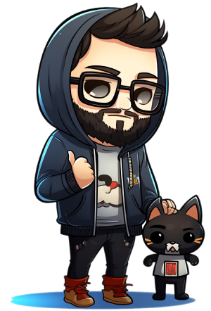
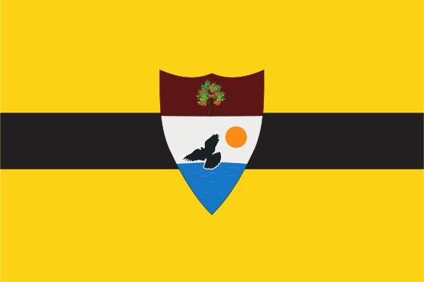

<a href="https://aaqi.org/">Hold Government Officials Accountable - aaqi.org</a>

<h1 align = "center"> Scott Weaver </h1>

### Lead Software Engineer @ Spot

##### 04/2022 - 08/2022

- Lead the integrations department from a tightly coupled monolith to a event / domain driven architecture.
- Implemented a forward chaining rule engine.
- Worked closely with cross functional teams to maintain and extend legacy code.
- Collaborated on a Tech Council to shape the company's technology strategy and roadmap.

### Team Lead / Software Engineer @ Olive

##### 07/2020 - 04/2022

- Collaborated with stakeholders and other orgs to plan, prioritize, and execute on sprint initiatives. Hired, mentored and coached a team of software developers.
- Architecting coding pipelines, processes, and company standards, encouraging innovation and continuous improvement.
- Created automation to reduce COVID testing time by 86% and automated COVID Vaccine scheduling and analysis.
- Automated supply chain purchase order dispatching and confirmations, and scheduling on legacy systems.

### Software Engineer @ Innovate Softworks

##### 06/2018 - 06/2021

- Partnered with industrial and health care clients to analyze and develop solutions to their in-house software needs.
- Worked with legacy applications, refactoring and updating for modern Windows APIs.
- Built full stack applications to generate and download firmware for industrial machines.
- Worked with a fully distributed, agile team of contracted junior developers.

### Software Engineer II @ Liberty Mutual

##### 01/2016 - 06/2018

- Developed innovative insurance product in new markets such as Nest Protect, RightTrack, HighwayHero, Auto OEM Telematics Programs.
- Created or maintained numerous internal and public REST and SOAP APIs in Node and MongoDB, focusing on reducing quoting time and increasing user retention.
- Lead a small team to create an API automating a search for existing discounts previously available to a customer.
- Maintained and migrated C# and Java legacy on-premises services to cloud platforms such as Cloud Foundry, AWS.

---

## Education

### Southern Illinois University

#### Bachelors in Computer Science | 08/2012 - 12/2015

- Minors: Electronic Engineering, Aviation Flight
- President of the Association for Computing Machinery (ACM)
- Director of SalukiLAN Charity LAN Party for ChildsPlay Charity.
- New Student Programs Saluki Peer Mentor

---

**Desktop:** &nbsp;  

**Laptop:** &nbsp;  

**Dev Server:** &nbsp;  

**Tech I Love:** &nbsp;

**Tech I Want to Use:** &nbsp;

---

  &nbsp;&nbsp;&nbsp;&nbsp;
   
  &nbsp;
  &nbsp;
  
   
   
   

